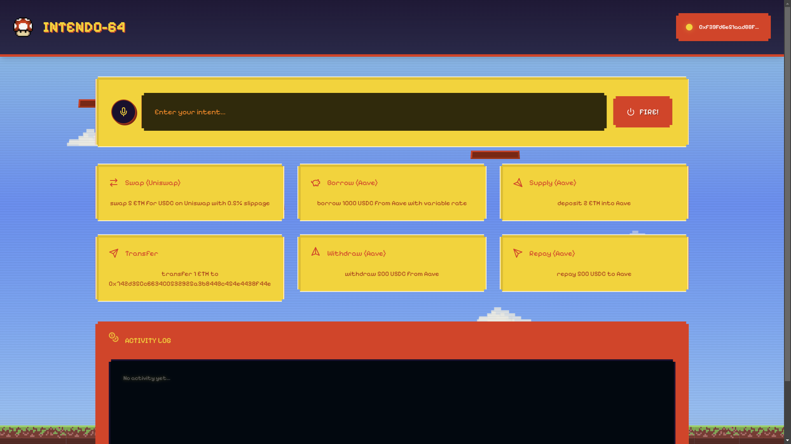
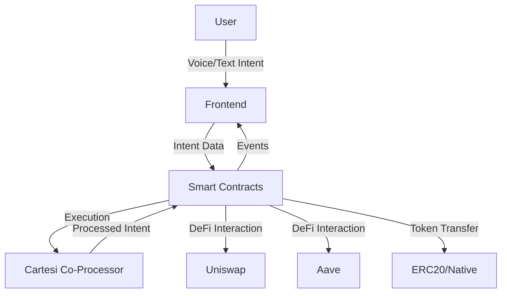

# Intendo-64 🎮
> Retro & Nostalgic Natural Language Intents

[](https://www.typescriptlang.org/)
[](https://reactjs.org/)
[](https://docs.soliditylang.org/)
[](https://tailwindcss.com/)
[](https://opensource.org/licenses/MIT)




## Overview

**Intendo-64** is a unique DeFi interaction platform that combines the nostalgia of retro gaming with modern DeFi capabilities. It features a natural language interface that allows users to execute complex DeFi operations through natural language as text or voice commands.

## Features

### 🎙️ Natural Language Processing
- Voice command recognition for DeFi operations
- Text-based intent input with auto-suggestions
- Real-time voice-to-text conversion
- Mobile and desktop browser support

### 🎯 Supported DeFi Operations

- **Uniswap:** Token swaps with slippage control, real-time tracking, major ERC-20 support.
- **Aave:** Lending, borrowing (variable/stable rates), deposit, withdrawal, repayment.
- **Generic:** ETH/ERC-20 transfers, transaction monitoring, real-time activity logging.

### 🎨 User Interface

- Retro design, responsive elements, real-time updates.
- Dynamic loading, pixel-perfect styling, interactive suggestions.
- Live activity feed.

## Technical Architecture

### Smart Contracts
- Base contract: `Intendo.sol`
- Protocol integrations:
  - `UniswapSolver.sol`: For Uniswap related operations
  - `AaveSolver.sol`: For Aave related operations 

> **Note**: The protocol solver integrations currently mock the actual protocol interactions due to unavailability of deployments on holesky of these protocols.

### Frontend
- Built with React + TypeScript
- Voice recognition integration
- Web3 integration with wagmi
- Tailwind CSS for styling
- Real-time contract event monitoring

### Co-Processor

The co-processor logic is built on Cartesi Machine and handles the natural language processing of user intents. It:

- Processes and analyzes the commands using NLP
- Extracts DeFi operation parameters and validates them
- Converts natural language intents into executable operations
- Provides real-time feedback on intent parsing status

## Architecture

### System Overview


### Data Flow
1. User provides intent through voice or text
2. Frontend processes and validates the input
3. Intent is sent to Cartesi Rollups for processing
4. Smart contracts execute the corresponding DeFi operations
5. Events are emitted and displayed in the UI
6. Real-time updates are shown in the activity feed

## Project Structure
```
intendo-64/
├── frontend/          # React frontend application
├── contracts/         # Solidity smart contracts
├── co-processor/      # Cartesi machine implementation
└── README.md         # Project documentation
```

## Examples

Here are some example commands you can try:

```
"swap 5 ETH for USDC with 0.5% slippage"
"borrow 1000 USDC from Aave with variable rate"
"deposit 2 ETH into Aave"
"withdraw 500 USDC from Aave"
"repay 1000 USDT to Aave"
"transfer 1 ETH to 0x742d35Cc6634C0532925a3b844Bc454e4438f44e"
```

Each command can be input either through voice recognition or text input.

## How to run?

### Start Anvil 

Make sure you have anvil from foundry installed. After that, run the following command:
```bash
$ anvil
```

### Start Nonodox

Make sure you have nonodox installed. After that, run the following command:
```bash
$ nonodox
```

### Deploy Intendo Contracts

Make sure the `.env` file is filled with the correct values, take reference from the `.env.example` files. After that, run the following command:

```bash
$ cd contracts && forge script script/Intendo.s.sol --broadcast  --rpc-url http:\\127.0.0.1:8545
```

### Start the Co-Processor

```bash
$ cd co-processor && yarn run start
```

### Start the Frontend

```bash
$ cd frontend && npm run start
```

After that, you can access the frontend at `http://localhost:5173`